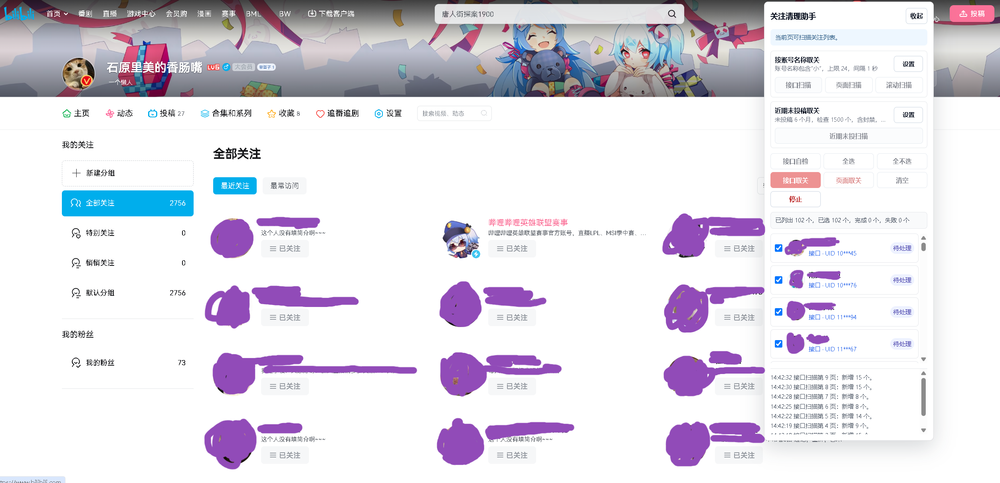
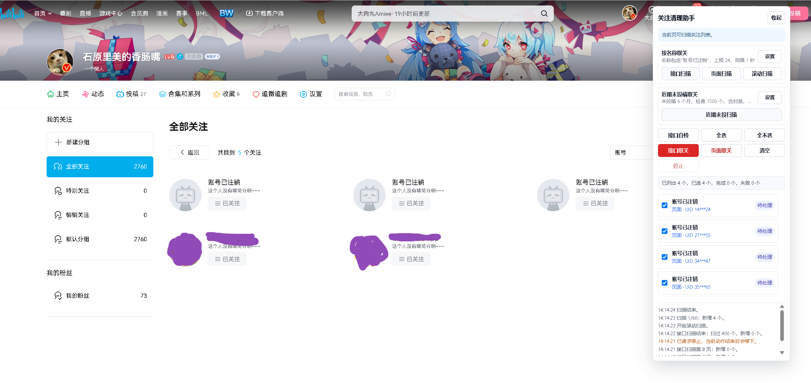
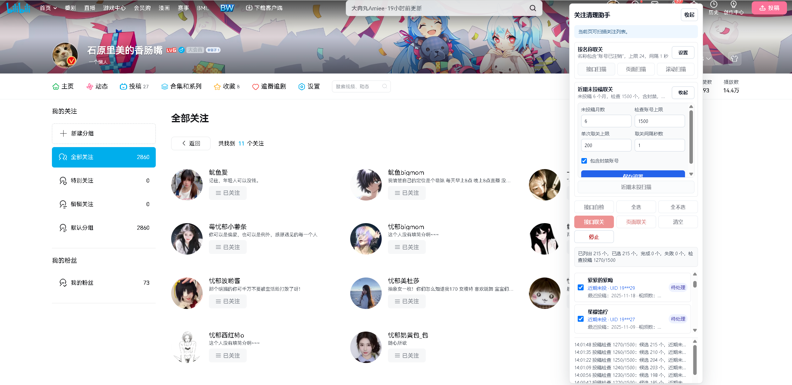

# Bilibili 关注清理助手

一个本地 Chrome/Edge 扩展，用于在哔哩哔哩关注列表页筛选关注账号，并在你确认后批量取关。

## 仓库结构

    bili-unfollow-helper-extension/
    |- extension/       # 浏览器实际加载的扩展代码
    |- docs/images/     # README 使用的截图，不需要打进扩展包
    `- README.md        # 安装和使用说明

安装或打包扩展时，只使用 extension/ 目录。根目录里的 README 和 docs/images/ 截图只是说明文档资源，不参与扩展运行。

## 功能

### 按账号名称取关

- 通过关注列表接口分页读取关注账号。
- 使用账号名称模糊匹配，匹配方式类似 %名称%。
- 默认匹配名称：账号已注销。
- 支持接口扫描、页面扫描、滚动扫描。
- 候选列表显示账号名称、打码 UID 和头像。

### 近期未投稿取关

- 自动读取关注列表，并检查账号投稿记录。
- 默认规则：
  - 从未投稿，列入候选。
  - 或最新投稿早于设置的未投稿月数，列入候选。
- 默认未投稿月数：6。
- 默认检查账号上限：5000。
- 可选择是否包含封禁或账号异常账号。
- 候选列表显示最近投稿日期、视频数和原因。

## 安装

1. 下载或克隆本项目到本地。
2. 如果是从 GitHub 下载的 ZIP，先解压到本地文件夹。
3. 打开 Chrome 扩展管理页：

       chrome://extensions/

   Edge 用户打开：

       edge://extensions/

4. 打开“开发者模式”。
5. 点击“加载已解压的扩展程序”。
6. 选择项目下的扩展代码目录：

       bili-unfollow-helper-extension/extension

不要选择仓库根目录 bili-unfollow-helper-extension，否则浏览器会把 README 和文档截图也放在同一个扩展目录里。

## 打包发布

如果要上传到 Chrome Web Store、Edge Add-ons 或手动打包，只打包 extension/ 目录里的内容，并确保压缩包根层级直接包含 manifest.json。

推荐压缩包结构：

    bili-unfollow-helper-extension.zip
    |- manifest.json
    |- background.js
    |- content.css
    |- content.js
    |- page-bridge.js
    `- wbi.js

不要把 README.md、docs/ 或截图文件放进扩展发布包。

## 使用前准备

1. 登录 B 站网页版。
2. 打开自己的关注列表页：

       https://space.bilibili.com/<你的 UID>/relation/follow?tagid=-1

3. 页面右侧出现“关注清理助手”面板后再开始扫描。
4. 建议先点击“接口自检”，确认当前登录态和接口访问正常。
5. 首次使用时，把单次取关上限和取关间隔设置得保守一些，先小批量验证。

## 使用流程

### 1. 扫描候选账号

按账号名称取关适合清理“账号已注销”等固定名称账号。

- “接口扫描”：通过关注列表接口读取账号，适合处理关注数量较多的情况。
- “页面扫描”：只扫描当前页面已经展示出来的账号。
- “滚动扫描”：自动滚动页面并扫描可见账号，适合作为接口扫描不可用时的补充。

近期未投稿取关适合找出长时间没有投稿的关注账号。

- 点击“设置”可以调整未投稿月数、检查账号上限、单次取关上限和取关间隔。
- 勾选“包含封禁账号”后，封禁或账号异常账号也会进入候选列表。
- 检查账号较多时会产生较多只读请求，建议按需降低检查上限。

### 2. 核对候选列表

扫描完成后，面板会列出候选账号。请逐个核对名称、头像、来源和原因，取消不想处理的勾选。

候选账号的 UID 会被打码显示，避免在截图或分享日志时暴露完整账号 ID。

### 3. 执行取关

- “接口取关”：通过 B 站接口执行，速度较快，但更容易受到风控限制。
- “页面取关”：模拟页面按钮操作，速度较慢，适合接口取关失败时尝试。
- “停止”：当前动作完成后停止后续处理。
- “清空”：清空当前候选列表，不会执行取关。

如果 B 站返回 HTTP 412 或 code: -352，通常是触发了风控。可以先暂停操作，在网页上手动点一次取关，并按提示完成验证后再重试。

## 设置说明

### 按账号名称取关

- 取关账号名称：按账号名称模糊匹配。
- 单次取关上限：一次最多处理多少个已勾选账号。
- 取关间隔秒数：接口取关时每次操作之间的等待时间。

### 近期未投稿取关

- 未投稿月数：最新投稿早于该月数即列入候选。
- 检查账号上限：最多检查多少个关注账号。
- 单次取关上限：一次最多处理多少个已勾选账号。
- 取关间隔秒数：接口取关时每次操作之间的等待时间。
- 包含封禁账号：勾选后会把接口返回为封禁或账号异常的账号纳入候选。

## 公开发布说明

- 本扩展是本地浏览器扩展，不包含服务器端组件。
- 项目文件不包含个人 Cookie、CSRF、账号配置或完整请求头。
- manifest.json 位于 extension/ 目录；公开范围由 GitHub、Chrome Web Store 或 Edge Add-ons 等发布平台控制。
- 如果作为公开仓库分享给其他用户，其他用户只需要下载项目，并按“安装”步骤加载 extension/ 目录即可。

## 注意事项

- 本扩展只在本地浏览器运行。
- 面板只显示打码 UID，不输出完整账号 ID。
- 不要把 Cookie、CSRF、完整请求头发给任何人。
- B 站接口可能触发风控，例如返回 HTTP 412 或 code: -352。
- 如果返回 code: -352，通常需要你在 B 站页面手动点一次取关，并按提示完成手机号验证。
- 近期未投稿扫描会产生较多只读请求，关注很多时建议适当调低检查账号上限。

## 权限

- 注入页面：https://space.bilibili.com/*
- 请求接口：https://api.bilibili.com/*
- 不申请读取浏览历史、剪贴板、标签页等权限。

## 文件说明

- extension/manifest.json：扩展清单。
- extension/content.js：页面面板、扫描和取关逻辑。
- extension/content.css：面板样式。
- extension/page-bridge.js：页面上下文接口请求桥接。
- extension/background.js：扩展后台请求兜底。
- extension/wbi.js：B 站 WBI 签名工具。
- docs/images/：README 使用的截图。

## 免责声明

本项目仅用于管理你自己的 B 站关注列表。请谨慎核对候选账号后再执行取关操作。
